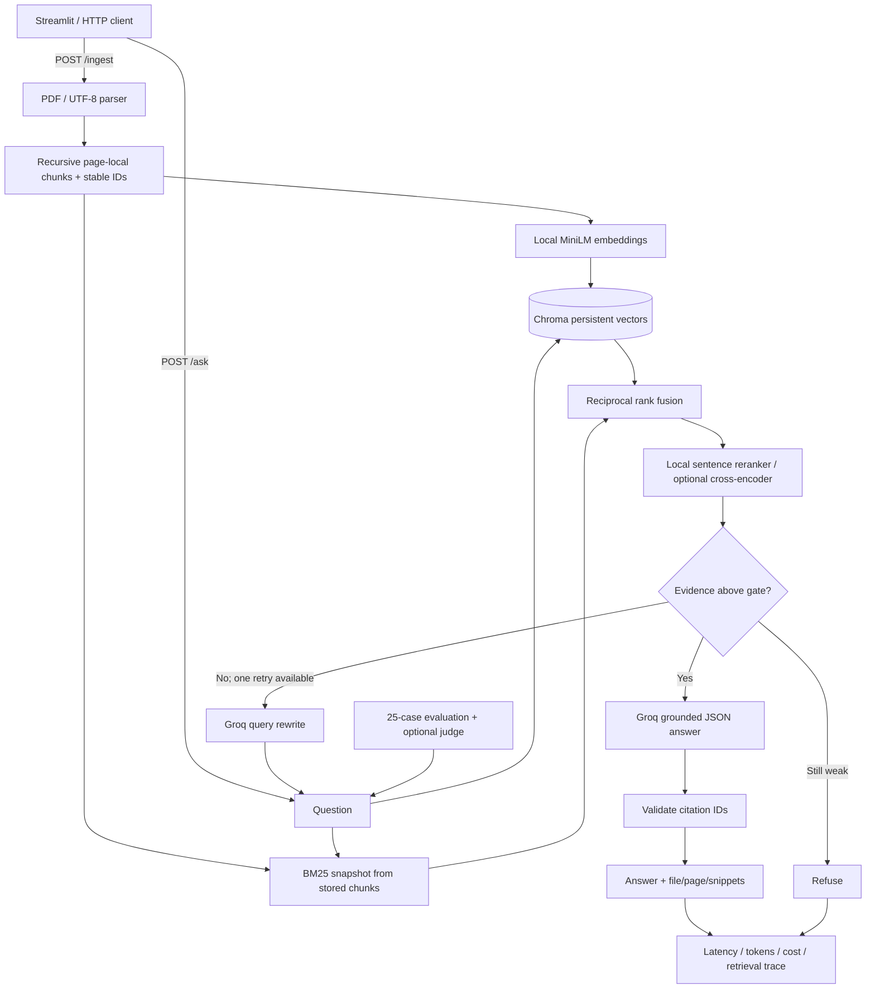

# GroundedDesk

**Ask your PDFs. Get cited answers. Measure whether the system is actually grounded.**

GroundedDesk is a local-first document Q&A tool for students, researchers and small
teams who need to inspect the evidence behind an answer. Upload PDF, TXT or Markdown,
ask a question, and get a concise answer with file, page and exact source snippets.
When the documents do not support an answer, the system should refuse.

Built by [Santhosh A](https://github.com/san342147). Python 3.12 · FastAPI · Chroma ·
BM25 · local reranking · Groq · Streamlit. MIT licensed.

**Measured locally:** 27 offline tests pass. Hybrid MRR@4 is 0.975 versus 0.950
for dense-only retrieval. The default relevance gate falsely rejects 3/20 supported
questions. Groq generation metrics are not measured in the included no-key run.

## The problem and the engineering decision

A plausible paragraph is not proof that document Q&A works. My earlier
`personal-knowledge-assistant` used Streamlit, Chroma, MiniLM and Groq with source
snippets. This project adds hybrid retrieval, reranking, a bounded recovery step,
an API boundary, request telemetry and an evaluation harness. The interesting
question is whether those additions improve retrieval and grounded answers.

This is a single-user local product with production-shaped boundaries. It is not
a hosted multi-tenant service: there is no authentication, per-user document scope,
OCR worker, upload queue or shared-storage coordination. Keep it bound to localhost.

## Local demo in 90 seconds (after first setup)

1. Run `start.bat`. On first run it creates `.venv`, installs dependencies, and
   opens `.env` in Notepad if a key is missing. Add `GROQ_API_KEY`, save and close.
2. Open [localhost:8501](http://localhost:8501). Upload `data/sample/fieldguide.pdf`.
3. Ask **“What is the maximum equipment loan period?”** The expected answer is
   seven calendar days, with evidence from page 4.
4. Ask **“What is the director's salary?”** The expected behavior is refusal.
5. Open [API docs](http://localhost:8000/docs) or run the evaluation below.

First installation downloads PyTorch and dependencies. The first upload and query
download the MiniLM model; allow several minutes and disk space. After that,
retrieval runs locally. **Questions and selected document text leave the machine
for Groq generation.** This is local-first, not fully offline.

## Architecture



## How retrieval works

- **Parsing:** `pypdf` extracts pages independently. Blank/scanned pages produce
  warnings, damaged and encrypted PDFs return an actionable error, and one bad
  page does not discard readable pages. OCR is explicitly out of scope. TXT/MD
  must be UTF-8 and use logical page 1. Uploads are capped at 20 MiB, PDFs at 500
  pages, and extracted text at two million characters. Original uploads are not saved.
- **Chunks:** recursively prefer paragraphs, newlines, sentence boundaries and
  spaces, then hard-split long spans. Default 900 characters with 150 overlap is
  roughly 180–230 English tokens and preserves nearby definitions while staying
  near MiniLM's 256-token input limit. This is a character heuristic; unusual text
  can still truncate. Chunks never cross PDF pages. Tune `CHUNK_SIZE` and
  `CHUNK_OVERLAP`; changed settings create a separate collection requiring re-ingest.
- **Candidates:** normalized `all-MiniLM-L6-v2` vectors in local Chroma (cosine)
  and BM25 over the same chunks. BM25 rebuilds from Chroma on startup/ingest.
  Reciprocal rank fusion sums `1 / (60 + rank)` across both lists. This avoids
  pretending BM25 scores and cosine distances share a scale.
- **Reranking:** score up to 20 fused candidates and keep `top_k` (default 4,
  request range 1–10). The default cheap sentence reranker reuses MiniLM. It scores
  each passage with `0.75 × best question/sentence cosine + 0.25 × query-term coverage`.
  Comparing individual sentences reduces dilution by unrelated text in a passage.
  Its sentence vectors use a bounded in-memory cache. This is a bi-encoder heuristic,
  not an entailment model. The initial evidence gate is 0.5, without held-out calibration.
- **Optional cross-encoder:** set `RERANKER_BACKEND=cross_encoder` and
  `RERANK_THRESHOLD=0.0` to use `cross-encoder/ms-marco-MiniLM-L-6-v2` with raw logits.
  This requires a second model download. Select it explicitly; the system does not
  silently switch backends when a download fails. The included default benchmark
  measures the sentence backend, not the cross-encoder.

The cross-encoder implementation has not been exercised with real weights in this
environment: its model CDN repeatedly timed out. The default sentence backend was
run end to end with real local embeddings. Docker is provided but was not built here
because no Docker executable is installed. A keyed Groq attempt returned connection
errors on all 25 cases in this environment; no generated answers were obtained.
The final report explicitly uses retrieval-only mode. Generation requires a working
Groq connection and has not been successfully measured.
- **One recovery step:** if the top score is weak and Groq is configured, rewrite
  once, retrieve again, and rerank the retry against the **original question**.
  Both attempts and the rewrite are logged. No loop after the retry.
- **Grounding:** Groq receives only retained chunks and a strict evidence-only
  prompt. Unknown/missing citation IDs or malformed JSON fail closed. File/page
  and snippets come from stored chunks, never model-generated metadata. Citation
  validation proves identity, not semantic support; that is why we measure grounding.

Re-uploading identical bytes under the same filename is idempotent. Changed bytes
or different filenames are new document versions; older versions remain searchable.
Start a new `VECTORSTORE_PATH` for a clean corpus. One API worker owns the store and
uses a lock for ingest/search consistency. This intentionally limits throughput.

## Latest measured evaluation

<!-- EVAL:START -->
Run: 2026-09-16T15:36:52+00:00. Mode: retrieval only; generation NOT measured.

| Metric | Result | Denominator / scope |
|---|---:|---|
| dense recall@4 | 1.000 | 20 supported questions |
| dense MRR@4 | 0.950 | 20 supported questions |
| hybrid recall@4 | 1.000 | 20 supported questions |
| hybrid MRR@4 | 0.975 | 20 supported questions |
| reranked recall@4 | 1.000 | 20 supported questions |
| reranked MRR@4 | 0.975 | 20 supported questions |
| Retrieval gate: supported acceptance | 17/20 | First pass, no generation |
| Retrieval gate: unsupported rejection | 5/5 | First pass, no generation |
| Warm reranked retrieval p50 / p95 | 40 / 48 ms | 25 CPU queries; excludes model loading |
| Faithfulness (LLM judge) | N/A | Groq generation not run |
| Answer relevance | N/A | Groq generation not run |
| End-to-end refusal correctness | N/A | Groq generation not run |
| Unsupported answer / hallucination rate | N/A | Groq generation not run |
| Generation latency and cost | N/A | Groq generation not run |
<!-- EVAL:END -->

Full report: [eval/results.md](eval/results.md). Definitions and judge rubric:
[eval/RUBRIC.md](eval/RUBRIC.md). All [25 golden cases](eval/golden.json) and the
[sample corpus](data/sample/README.md) are included.

**Interpretation:** all three stages retrieved the supporting span within four
results on all 20 supported questions. Hybrid improved first-result ranking slightly
(MRR 0.950 to 0.975); sentence reranking did not improve MRR further. Its initial gate
incorrectly rejected visitor booking lead time, damaged-equipment procedure and
evacuation assembly location, even though their evidence was retrieved. The 0.5 gate
is too conservative for these paraphrases. I would calibrate it on a separate
development split and measure the tradeoff against harder negatives, rather than
lowering it until this tiny set passes. The five negative rejections are a retrieval
gate result, not a measured hallucination rate. Generation remains unmeasured.

```powershell
.venv\Scripts\activate
python -m pytest
python -m eval.run --update-readme
# Explicitly avoid all Groq calls, even with a key configured:
python -m eval.run --retrieval-only --update-readme
```

`python -m eval.run` always writes `eval/results.md` after a successful run. It uses
an isolated fresh Chroma store under ignored `eval/runs/`, indexes only the sample
PDF, warms the models, then records dense/hybrid/reranked results. Add a Groq key
to enable real generation and the documented LLM judge. Inspect per-question
retrieval, answers, judgments and usage in ignored `eval/runs/latest.json`.
`--update-readme` copies the measured table into this README.

## Cost, latency and observability

Embeddings, BM25 and reranking use the local CPU; there is no embedding API bill.
Groq lists `openai/gpt-oss-20b` at **$0.075 / million input tokens** and **$0.30 /
million output tokens**, checked September 15, 2026 against
[Groq's model documentation](https://console.groq.com/docs/model/openai/gpt-oss-20b).
At those rates, an illustrative 2,000-input / 250-output-token completion costs
**$0.000225**. This is arithmetic, not a measured serving average. Rewrites and
judge calls add cost. Update rates in `.env` when changing models/providers.

Every request records latency, chunk IDs, tokens and estimated USD cost in local,
rotating `logs/requests.jsonl`. Ask responses include the same fields. Usage includes
successful rewrite calls. Failed provider attempts may be billed without returned
usage, so these are estimates, not invoices. Raw questions and answer text are not
logged, but rewrite text can contain user data; logs stay ignored and local.
`GET /metrics` reports process-local totals and a last-1,000-request latency window.
Warm retrieval latency excludes initial downloads/model loading. Generation latency
depends on network, provider load and output length and must be measured separately.

## Manual setup (Windows / Python 3.12)

```powershell
py -3.12 -m venv .venv
.venv\Scripts\activate
python -m pip install torch==2.8.0 --index-url https://download.pytorch.org/whl/cpu
python -m pip install -r requirements.txt
Copy-Item .env.example .env
notepad .env
python scripts/launch.py
```

If `py` is unavailable, use `python -m venv .venv` after confirming `python --version`
is 3.12. If Windows opens the Microsoft Store, install Python 3.12 from python.org
with **Add Python to PATH** and disable the Store execution alias if necessary.
PowerShell activation restrictions can be avoided by using
`.venv\Scripts\python.exe` directly. No global execution-policy change is necessary.
The launcher owns both processes and stops them on Ctrl+C; occupied ports produce
an error instead of silently connecting to another app.

The launcher sets `HF_HOME=.cache/huggingface` and suppresses the Windows symlink
warning: cache duplication costs disk space but does not require Developer Mode.
Cold imports of the ML libraries also took several minutes in one Windows session,
even with weights cached. Allow the first upload to finish; subsequent requests
reuse loaded models. The reported warm latency excludes this startup cost.
If Hugging Face downloads stall, retry on a working connection with
`$env:HF_HUB_DOWNLOAD_TIMEOUT='120'`. The pinned `hf-xet` helper supports the model
host's transfer protocol. After both models are cached, set
`$env:HF_HUB_OFFLINE='1'` to skip remote metadata checks during offline retrieval.
Pinning Python 3.12 and using prebuilt wheels avoids compiling Chroma dependencies.
If an old pip attempts a source build, upgrade pip and retry. Dependency top-level
versions are pinned; transitive resolution is not a fully locked supply-chain build.
After changing `requirements.txt`, rerun pip explicitly (`start.bat` skips installation
once its local installation marker exists).

## API

| Endpoint | Purpose |
|---|---|
| `POST /ingest` | Multipart `file`; returns indexed chunk count and warnings |
| `POST /ask` | JSON `question`, optional `top_k`; returns answer, citations, telemetry |
| `GET /health` | Chroma heartbeat/count + Groq credentials/model visibility; 503 if degraded |
| `GET /metrics` | JSON request totals, token usage, cost and recent latency |

Groq health lists models; it does not prove inference quota is available. No key
returns a degraded health status. Supported retrieval without a key gives a clear
503 `generation_unavailable`, not an invented answer. Empty/unsupported evidence
returns a structured refusal. Provider failures return 503 without logging secrets.

```powershell
curl.exe -F "file=@data/sample/fieldguide.pdf" http://127.0.0.1:8000/ingest
Invoke-RestMethod http://127.0.0.1:8000/ask -Method Post -ContentType 'application/json' -Body '{"question":"What is the maximum equipment loan period?","top_k":4}'
```

## Docker (API only)

```sh
docker build -t groundeddesk .
docker run --rm -p 127.0.0.1:8000:8000 --env-file .env \
  -v groundeddesk-index:/app/vectorstore \
  -v groundeddesk-models:/app/.cache groundeddesk
```

The image runs as an unprivileged user. Keys are supplied at runtime. Docker ignores
`.env`, uploads, caches and indexes. For the UI, run Streamlit locally and point
`GROUNDEDDESK_API_URL` at the API if its address changes. Do not expose this unauthenticated
single-user API to the internet. Add authentication, scope isolation, edge request
limits and parser worker isolation before hosting it publicly.

## What I would do next

1. Build an independent holdout and include domain-specific hard negatives. Compare
   dense-only, hybrid and reranked accuracy/latency before keeping complexity.
2. Calibrate the refusal threshold on a development split, then freeze it for testing.
3. Measure real Groq answers with a separate judge and manually audit claim support.
4. Add OCR as an explicit ingestion job with page-quality diagnostics.
5. Add scoped document deletion/version replacement, authentication and isolated parser workers.

## Repository map

`app/` contains the API, UI and pipeline. `eval/` contains golden cases, scoring and
reports. `tests/` covers splitting, corrupt/empty documents, fusion, refusal, bounded
rewrite and citation validation without network calls. `scripts/` contains the
local launcher and deterministic sample PDF builder. CI runs offline tests on Windows
and Linux; model downloads and live Groq calls are deliberately outside unit tests.

**GitHub topics:** `rag`, `fastapi`, `groq`, `evaluation`, `python`, `chromadb`
